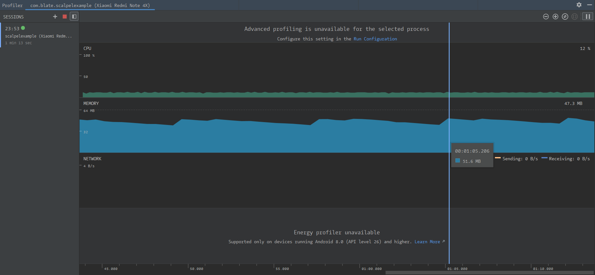

# 测试  

* 测试环境  

设备 : 小米 Redmi note 4x  

项目|参数
:-|:-
MIUI版本|MIUI 10 9.8.29 开发版
Android版本|7.0
CPU|高通骁龙625
RAM|3.00GB
DISK|32.00GB

随机字符串生成函数:
```java
private String randomCode128String(int length,String area) {
        char[] charArrays = new char[length];
        Random random = new Random();
        for (int i = 0; i < length; i += 1) {
            charArrays[i] = area.charAt(random.nextInt(area.length()));
        }
        return new String(charArrays);
    }
```

---

## code128A  
* 性能测试  

  

占用内存约50MB  
测试编码5000个Code128A支持的随机字符串,长度为15,耗时171924ms.这个时间包含了生成随机字符串的时间和存储图片到闪存的时间  

随机字符串生成方法:  
```java
String content = randomCode128String(15,"01234567899ABCDEFGHIJKLMNOPQRSTUVWXYZ!\"#$%&'()*+,-./:;<=>?@[\\]^_");
```

## code128B  
* 性能测试  

  

占用内存约50MB  
测试编码5000个Code128B支持的随机字符串,长度为15,耗时207025ms.这个时间包含了生成随机字符串的时间和存储图片到闪存的时间  

随机字符串生成方法:  
```java
String content = randomCode128String(15,"01234567899abcdefghijklmnopqrstuvwxyzABCDEFGHIJKLMNOPQRSTUVWXYZ!\"#$%&'()*+,-./:;<=>?@[\\]^_`{|}~");
```

## code128C  
* 性能测试  

  

占用内存约50MB  
测试编码5000个Code128BC支持的随机字符串,长度为20,耗时155874ms.这个时间包含了生成随机字符串的时间和存储图片到闪存的时间  

随机字符串生成方法:  
```java
String content = randomCode128String(20,"0123456789");
```